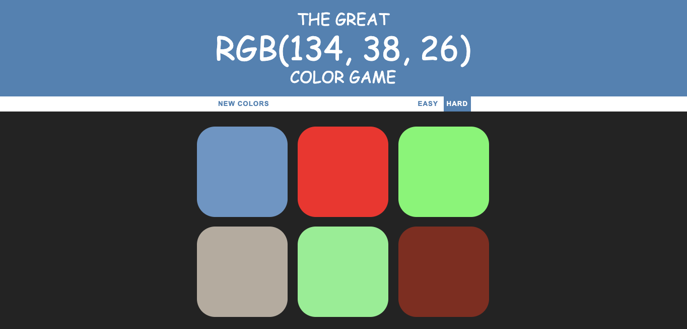

# Color_Game
Simple HTML/JS game to practise RGB colors

## How to use this project

To get started just open colorGame.html file

## What You're Getting
```bash
├── colorGame.html
├── script.js - This has all the action functions.
├── style.cc # Styles for colors game

## Screenshot from the game


